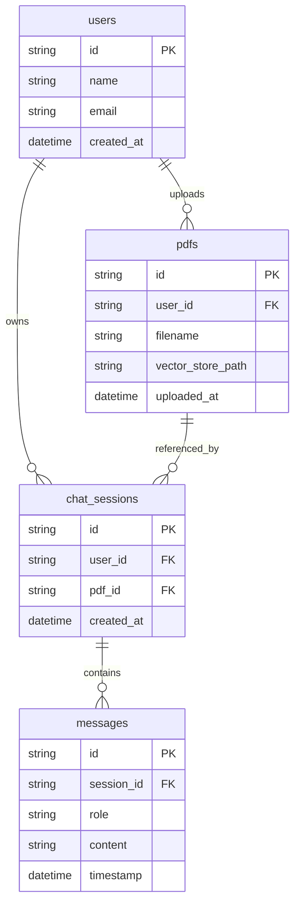

# 📄 PDF Intelligence — RAG Chatbot with Conversational Memory (Phases 1–9)

> **Production-Grade Retrieval-Augmented Generation (RAG) System** built with **FastAPI**, **LangChain**, **FAISS**, **SQLAlchemy**, and **Next.js 16 (TypeScript & Tailwind CSS)**.

---

## 📌 Architecture & Developer Context

This document serves as a complete technical guide and developer context manual for engineering teams and AI coding agents continuing work on this codebase.

```text
┌───────────────────────────────────────────────────────────────────────────────────┐
│                                SYSTEM ARCHITECTURE                                │
├──────────────────────────┬─────────────────────────────────┬──────────────────────┤
│ NEXT.JS 16 FRONTEND      │ FASTAPI BACKEND (PORT 8000)     │ VECTOR & RELATIONAL  │
│                          │                                 │ DB STORAGE           │
│ • Bento Grid Dashboard   │ • SSE Token Streaming Endpoint  │ • FAISS Vector Store │
│ • Emerald/Obsidian UI    │ • LangChain Qwen2.5-7B RAG      │ • SQLite (app.db)    │
│ • Optimistic Session Mgmt│ • Memory Context Injection      │ • SQLAlchemy ORM     │
└──────────────────────────┴─────────────────────────────────┴──────────────────────┘
```

---

## 🛠️ Technology Stack

| Component | Technology | Purpose / Notes |
| :--- | :--- | :--- |
| **Backend API** | FastAPI (Python 3.10+) | Async streaming server with SSE support |
| **Orchestration** | LangChain | Text loading, chunking, and prompt context pipeline |
| **Vector Store** | FAISS (`faiss-cpu`) | Local vector database indexing document chunks |
| **Embeddings** | `sentence-transformers/all-MiniLM-L6-v2` | Local HuggingFace embeddings |
| **LLM Engine** | `Qwen/Qwen2.5-7B-Instruct` | High-accuracy HuggingFace Inference API |
| **Database** | SQLite + SQLAlchemy ORM | Relational persistence (`users`, `pdfs`, `chat_sessions`, `messages`) |
| **Frontend** | Next.js 16 (App Router + Turbopack) | Modern React framework with TypeScript |
| **Styling** | Tailwind CSS v4 + Lucide Icons | Dark Obsidian Slate (`#0B0F17`), Emerald Green (`#05b060`), Red Alerts |

---

## 🗺️ Completed Development Phases (Phase 1 to Phase 9)

### Phase 1: Diagnostic & Project Environment Setup
- Created virtual environment, `.env` file management, and directory structures for backend and frontend.

### Phase 2: PDF Parsing & Text Extraction Engine
- **File**: [`backend/services/pdf_loader.py`](file:///d:/LangChain/CHATBOT%20PROJECT/backend/services/pdf_loader.py)
- Integrated `PyPDFLoader` to parse PDF documents, extracting raw text and page-level metadata.

### Phase 3: Recursive Text Chunking Strategy
- **File**: [`backend/services/chunker.py`](file:///d:/LangChain/CHATBOT%20PROJECT/backend/services/chunker.py)
- Implemented `RecursiveCharacterTextSplitter` with `chunk_size=1000` and `chunk_overlap=200` to preserve context boundaries across paragraphs.

### Phase 4: Local Vector Embeddings & FAISS Indexing
- **File**: [`backend/services/vector_store.py`](file:///d:/LangChain/CHATBOT%20PROJECT/backend/services/vector_store.py)
- Built vector index pipeline using `HuggingFaceEmbeddings` and `FAISS`. Vectors are persisted locally under `backend/storage/vectors/`.

### Phase 5: Strict RAG Prompt Engineering & LLM Integration
- **File**: [`backend/services/llm.py`](file:///d:/LangChain/CHATBOT%20PROJECT/backend/services/llm.py)
- Configured `huggingface_hub.InferenceClient` targeting `Qwen/Qwen2.5-7B-Instruct`. System prompts enforce strict context boundaries (declining unverified out-of-document queries).

### Phase 6: Server-Sent Events (SSE) Streaming Q&A
- **File**: [`backend/routers/chat.py`](file:///d:/LangChain/CHATBOT%20PROJECT/backend/routers/chat.py)
- Implemented token streaming endpoints returning real-time response streams to the Next.js UI.

### Phase 7: Document Upload & PDF Guard
- **Files**: [`backend/routers/upload.py`](file:///d:/LangChain/CHATBOT%20PROJECT/backend/routers/upload.py), [`frontend/components/PdfUploader.tsx`](file:///d:/LangChain/CHATBOT%20PROJECT/frontend/components/PdfUploader.tsx)
- Drag-and-drop PDF workspace with 15MB file size limits and file format validation. Added PDF guard to disable chat when no document is attached.

### Phase 8: Modern Bento Grid UI & Design System
- **Files**: [`frontend/components/ChatInterface.tsx`](file:///d:/LangChain/CHATBOT%20PROJECT/frontend/components/ChatInterface.tsx), [`frontend/app/globals.css`](file:///d:/LangChain/CHATBOT%20PROJECT/frontend/app/globals.css)
- 12-column Bento Grid dashboard, custom brand logo mark (`icon.png`), fixed `100vh` viewport with isolated inner window scrolling, matching Emerald Green scrollbars, and branded action loading popup modals.

### Phase 9: Conversational Memory & Relational DB Persistence
- **Files**: [`backend/database/db.py`](file:///d:/LangChain/CHATBOT%20PROJECT/backend/database/db.py), [`backend/database/models.py`](file:///d:/LangChain/CHATBOT%20PROJECT/backend/database/models.py), [`backend/services/memory.py`](file:///d:/LangChain/CHATBOT%20PROJECT/backend/services/memory.py), [`backend/routers/session.py`](file:///d:/LangChain/CHATBOT%20PROJECT/backend/routers/session.py)
- SQLite SQLAlchemy database (`app.db`) auto-persists chat sessions and multi-turn message history.
- Automatically injects the last 6 messages into LLM prompts as conversational memory.
- Endpoints: `GET /api/sessions`, `GET /api/sessions/{session_id}/messages`, `DELETE /api/sessions/{session_id}`.
- Features accurate client-side browser timestamp conversion and optimistic instant UI session deletion.

---

## 🗄️ Database Relational Schema



---

## 📁 Repository Directory Structure

```text
PDF CHATBOT PROJECT/
├── backend/
│   ├── app.py                   # FastAPI Application Entrypoint & Router Registry
│   ├── database/
│   │   ├── db.py                # SQLAlchemy Session & Engine Setup
│   │   └── models.py            # Database Models (User, PDF, ChatSession, Message)
│   ├── routers/
│   │   ├── chat.py              # Chat Streaming API Endpoint
│   │   ├── session.py           # Sessions & Message History API Endpoints
│   │   └── upload.py            # PDF Processing & Vector Indexing Endpoint
│   ├── services/
│   │   ├── chunker.py           # Text Splitter Service
│   │   ├── llm.py               # HuggingFace Qwen2.5-7B Inference Service
│   │   ├── memory.py            # DB Memory & Session Life-Cycle Service
│   │   ├── pdf_loader.py        # PyPDFLoader Extraction Service
│   │   └── vector_store.py      # FAISS Vector Embeddings Manager
│   └── storage/
│       ├── pdfs/                # Stored Raw PDF Files
│       └── vectors/             # Persisted FAISS Vector Indexes
├── frontend/
│   ├── app/
│   │   ├── globals.css          # Color Variables, Dark Scrollbars & Glassmorphism
│   │   ├── layout.tsx           # Fixed 100vh Root Layout & Favicon Metadata
│   │   ├── page.tsx             # Home Canvas Page
│   │   └── icon.png             # Custom Website Brand Logo
│   ├── components/
│   │   ├── ChatInterface.tsx    # Bento Grid Stage & Conversational Interface
│   │   └── PdfUploader.tsx      # Document Vault Dropzone Component
│   ├── lib/
│   │   └── api.ts               # Frontend API Client Helpers
│   └── public/
│       └── icon.png             # Public Assets Brand Logo
└── README.md                    # Project Documentation & AI Context Manual
```

---

## ⚡ Quick Start Guide

### 1. Backend Server Setup
```bash
# Navigate to backend directory
cd backend

# Activate Virtual Environment (Windows PowerShell)
.\venv\Scripts\activate

# Install dependencies
pip install -r requirements.txt

# Run FastAPI Server
uvicorn backend.app:app --reload --port 8000
```

### 2. Frontend Application Setup
```bash
# Navigate to frontend directory
cd frontend

# Install dependencies
npm install

# Run Next.js Development Server
npm run dev
```

Open **`http://localhost:3000`** in your web browser to use the application!

---

## 🔮 Next Planned Phases

- **Phase 10**: User Authentication System (JWT Auth, signup/login endpoints in FastAPI).
- **Phase 11**: Multi-User Access Control (User-level document isolation and session security).
- **Phase 12**: Production Deployment (Docker containerization & cloud vector database integration).
